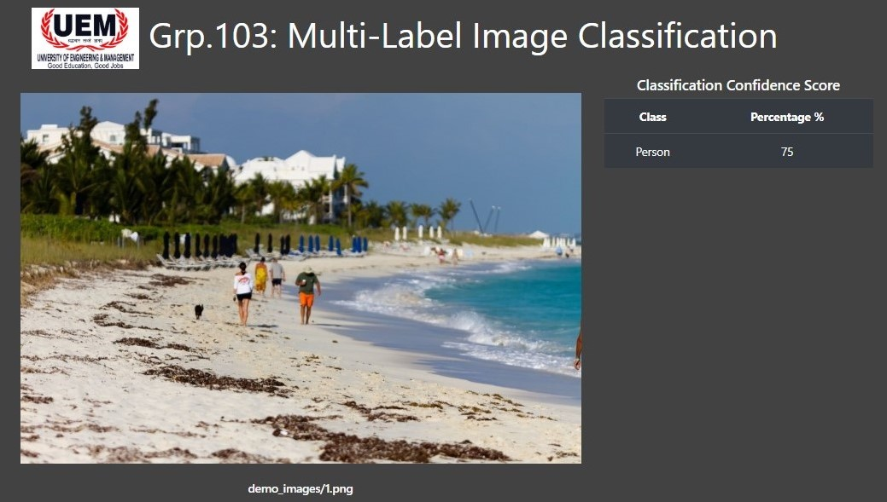
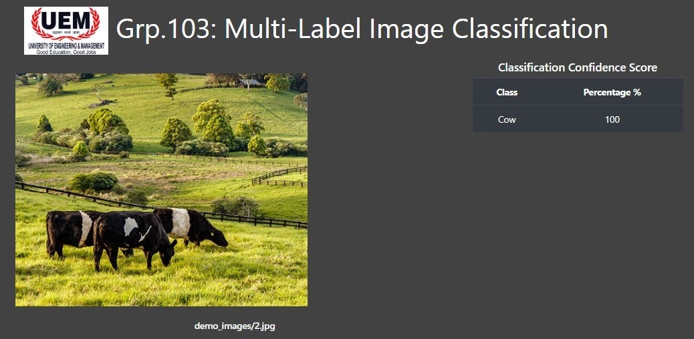
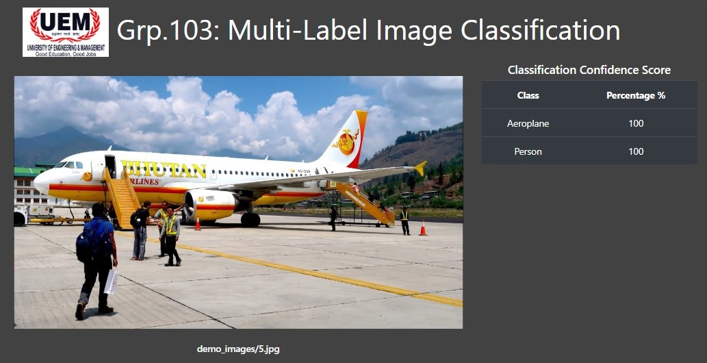
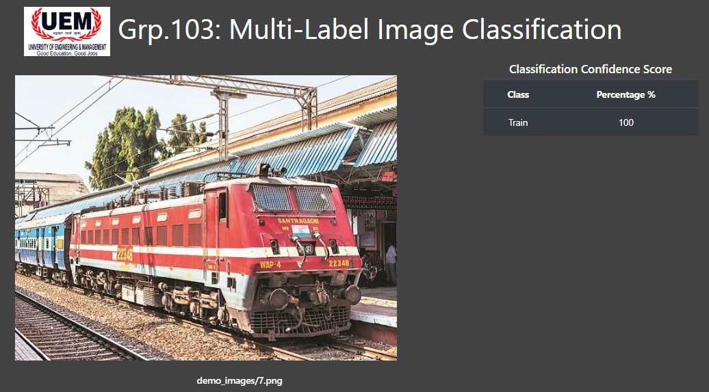
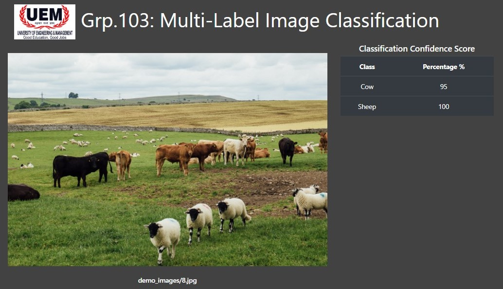

# Multi Label Image Classification Demo
A simple and functional demo website for my B.Tech final year project demo.

## Getting started.
You need to have `python3` and `pip3` in your system.

### Installing
- First clone the project
  ```
  git clone https://github.com/sdsubhajitdas/Final-Year-Project-Demo.git
  ```
- (Optional) If you like you can use virtualenv to create a private environment and then activate it.
- Installing the required packages.
  ```
  pip install -r requirements.txt
  ```
### Usage
- Running the project is very simple. It is a simple flask application which is serving a tensorflow model already pretrained & included in the repository. <br>
  Run this command to start the local server.
  ```
  python run.py
  ```
  This should give a output like this.<br>
  

- Copy the url shown in the terminal and open in your browser. You will be greeted with a page like this.
  

### Outputs
Our demo can identify 20 different classes of objects. Below are the following classes.
```
Aeroplane, Bicycle, Bird, Boat, Bottle, Bus, Car, Cat, Chair, Cow, Dining Table,
Dog, Horse, Motorbike, Person, Potted Plant, Sheep, Sofa, Train, Tvmonitor
```
If you are interested about all the training, model generation work, what methods and architeture we have used then you will have to wait. Will publish the other repository soon [here](#) ***(No link yet)***.

Some of the results are below. Click to see the outputs.<br>

<details><summary>Output 1</summary>
<p>



</p>
</details>

<details><summary>Output 2</summary>
<p>



</p>
</details>

<details><summary>Output 3</summary>
<p>


</p>
</details>

<details><summary>Output 4</summary>
<p>



</p>
</details>

<details><summary>Output 5</summary>
<p>



</p>
</details>

<details><summary>Output 5</summary>
<p>


</p>
</details>

<details><summary>Output 6</summary>
<p>



</p>
</details>

<details><summary>Output 7</summary>
<p>


</p>
</details>
